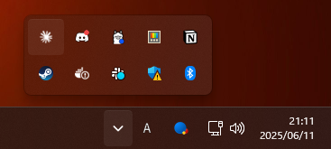
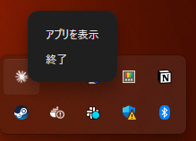
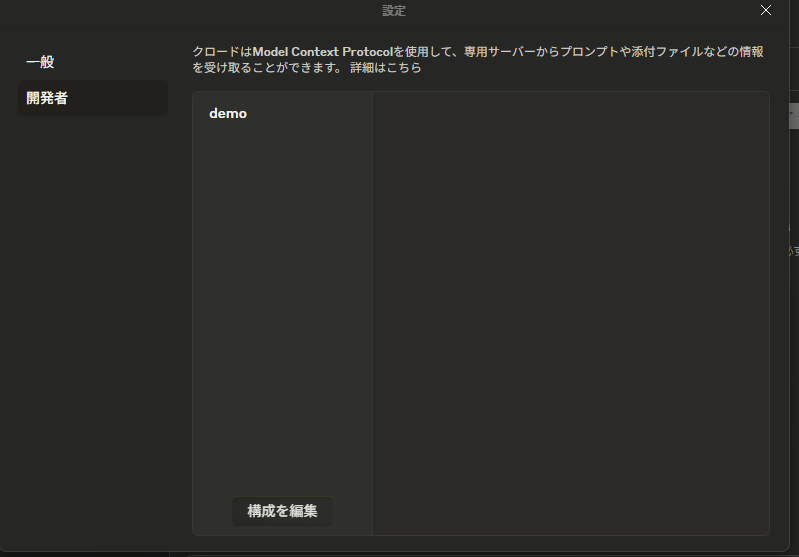
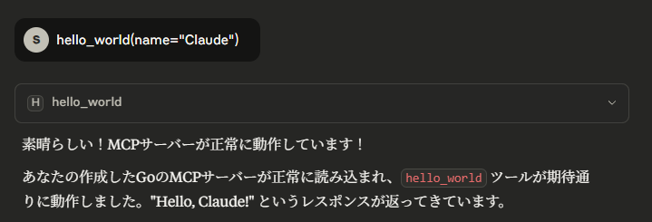

# Go MCP demo
## 言語
* Go1.24
## 環境構築
* Docker
* DevContainer
### 環境構築手順
#### [VsCode使用者向け](./docs/VsCodeDevContainer.md)

# 使用方法 Cloude Desktopを使用する場合
## MCPをビルド
Windowsで動作確認したいので以下のように実行
```bash
GOOS=windows GOARCH=amd64 go build -o mymcp.exe main.go
```
### Cloude Desktopの設定を開く
左上のハンバーガーメニュー→ファイル→設定→開発者→構成を編集を押下

## Cloude Desktopの設定ファイルを編集する
claude_desktop_config.json
```json
{
  "mcpServers": {
    "demo": {
      "command": "C:\\mcp\\mymcp.exe"
    }
  }
}
```
## 出力されたファイルをC:\mcpに配置する

## Cloude Desktopアプリを終了する
1. Windowsのタスクバーの^を押下<br>

2. Cloudeが表示されているので右クリックから終了を押下<br>


## Cloude Desktopアプリを起動
設定ファイルを開いた手順と同じ操作を行い、読み込まれていることを確認<br>

## CloudeにMCP実行を命令する
```
hello_world(name="Claude")
```
このように表示される<br>

